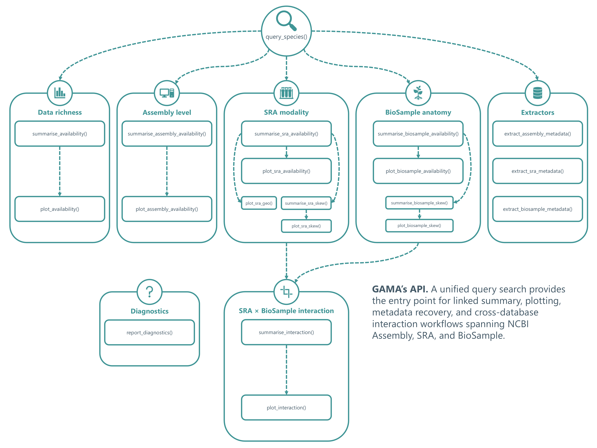
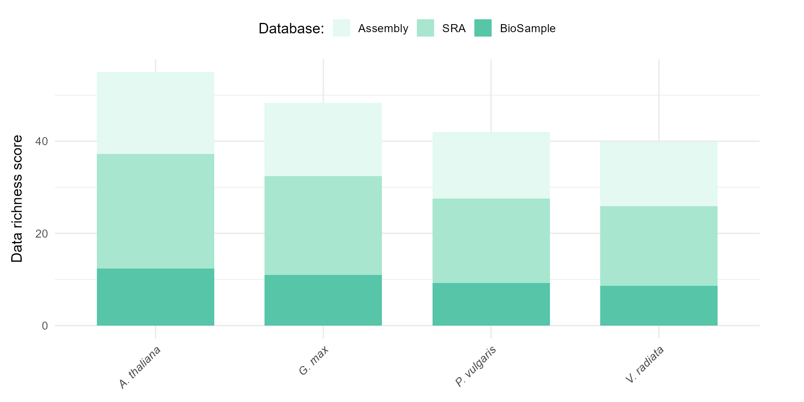
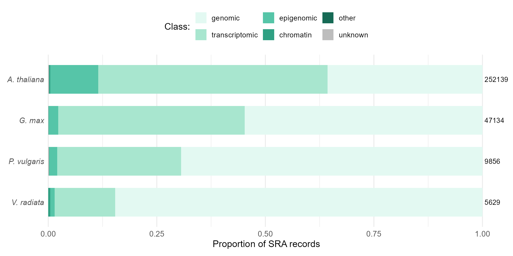
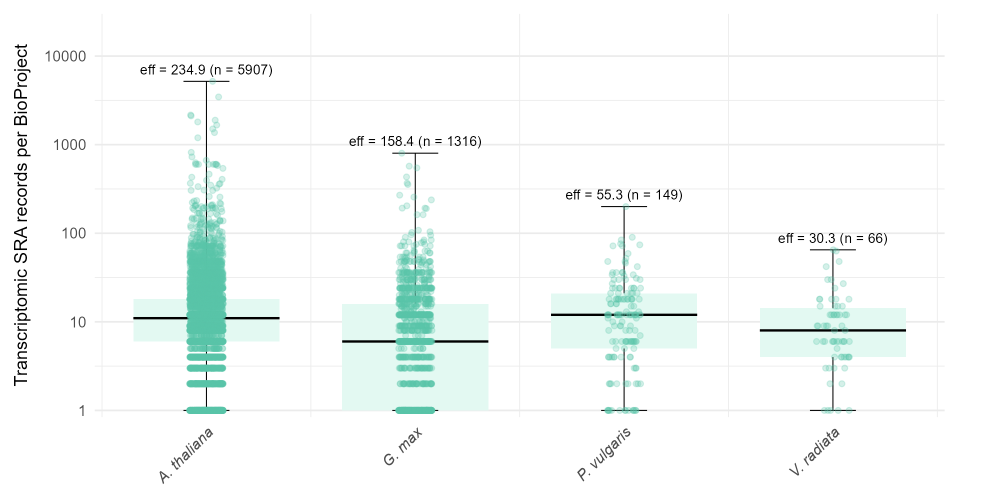
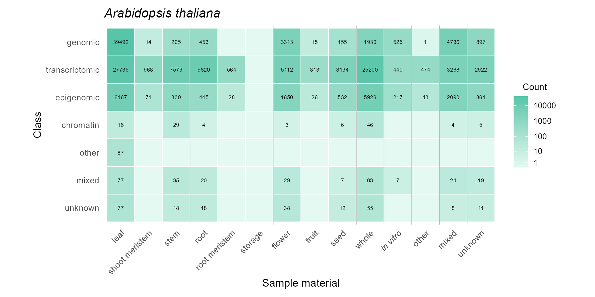
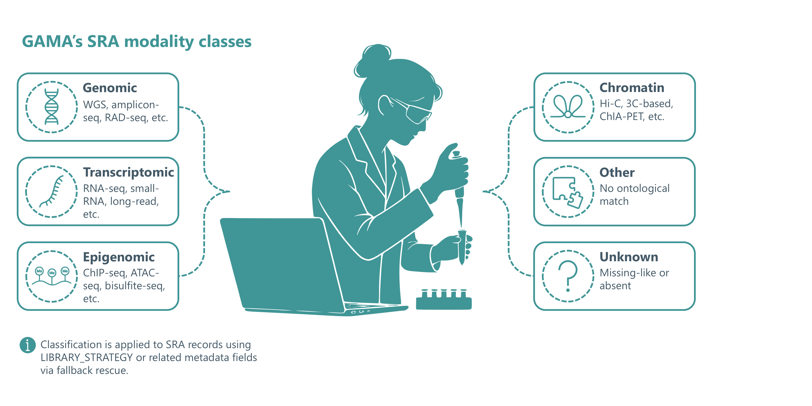
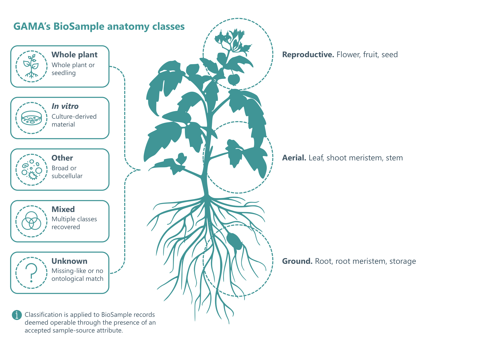

# GAMA
**Genomic Availability & Metadata Analysis Tool**

<!-- badges: start -->
[](https://github.com/JLewis-dev/GAMA/actions/workflows/R-CMD-check.yaml)
<!-- badges: end -->

> &#9888;&#65038; **Development Status: Active**<br>
> GAMA is currently in early development. Interfaces, methods, and outputs may change.<br>
> Users are encouraged to validate results independently and report issues.

Public sequencing archives contain an enormous amount of biological information, but their value can only be realised when the data are findable, accessible, interpretable, and reusable. Without tools for rapidly organising and filtering accession metadata, these records risk becoming a form of digital waste: technically available, but difficult to utilise effectively. GAMA addresses this issue by unifying Assembly, SRA, and BioSample species searches into a single R workflow to produce data availability summaries and ontology-based breakdowns of sequencing modality and sample-source anatomy.

---

## Overview

GAMA:

- Unifies queries across NCBI Assembly, SRA, and BioSample
- Computes a data richness score
- Classifies records by:<br>
  assembly level<br>
  sequencing modality<br>
  sample-source anatomy
- Generates publication-ready visualisations
- Enables targeted extraction of accession metadata

<p align='center'>
  
</p>

See the **[GAMA user guide](docs/GAMA_user_guide.md)** for a comprehensive overview of functions and methods.

---

## Installation

Install the development version from GitHub using `pak`:

``` r
install.packages('pak')
pak::pak('JLewis-dev/GAMA')
```

---

## Quick-start

### 1. Load package

``` r
library(GAMA)
```

### 2. Configure NCBI access to improve rate limits (optional)

``` r
#rentrez::set_entrez_key('YOUR_API_KEY')
```

Uncomment and add your API key if you have one.

### 3. Query NCBI databases using a list of species

``` r
RESULTS <- query_species(c('Vigna angularis', 'Vigna vexillata'))
```

### 4. Summarise data richness

``` r
SUMMARY <- summarise_availability(RESULTS)
print(SUMMARY)
```

### 5. Visualise data richness

``` r
plot_availability(SUMMARY)
```

### 6. Summarise SRA modality composition

``` r
SRA_SUMMARY <- summarise_sra_availability(RESULTS)
print(SRA_SUMMARY)
```

### 7. Visualise SRA modality composition

``` r
plot_sra_availability(SRA_SUMMARY)
```

### 8. Extract filtered Assembly accession metadata

``` r
ASM <- extract_assembly_metadata(RESULTS, species = 'Vigna angularis', best = TRUE)
print(ASM)
```

### 9. Extract filtered SRA accession metadata

``` r
SRA <- extract_sra_metadata(RESULTS, species = 'Vigna vexillata', class = 'genomic')
print(SRA)
```

### 10. Cite

``` r
citation('GAMA')
```

---

## Example outputs

### Data richness

<p align='center'>
  
</p>

Data richness provides a weighted overview of sequence availability across species, combining genome assembly quality with transformed SRA and BioSample record counts.

<details>
<summary>Data richness table</summary>

| species | Assembly | SRA | BioSample | A | S | B | score |
| :--- | ---: | ---: | ---: | ---: | ---: | ---: | ---: |
| Arabidopsis thaliana | 378 | 243573 | 248739 | 17.8104 | 24.8064 | 12.4242 | 55.0409 |
| Glycine max | 51 | 46588 | 58528 | 15.8777 | 21.4982 | 10.9773 | 48.3533 |
| Phaseolus vulgaris | 16 | 9629 | 9948 | 14.5109 | 18.3453 | 9.20523 | 42.0614 |
| Vigna radiata | 9 | 5617 | 5701 | 13.9703 | 17.2675 | 8.64857 | 39.8863 |

</details>

### Sequencing modality

<p align='center'>
  
</p>

Sequencing modality summarises the proportional composition of methodological classes. Similar outputs are available for Assembly level and BioSample anatomy composition.

<details>
<summary>Sequencing modality table</summary>

| species | SRA | genomic | transcriptomic | epigenomic | chromatin | other | unknown |
| :--- | ---: | ---: | ---: | ---: | ---: | ---: | ---: |
| Arabidopsis thaliana | 243573 | 88839 | 126366 | 27239 | 717 | 87 | 325 |
| Glycine max | 46588 | 25509 | 20017 | 1002 | 24 | 0 | 36 |
| Phaseolus vulgaris | 9629 | 6661 | 2765 | 181 | 4 | 0 | 18 |
| Vigna radiata | 5617 | 4761 | 775 | 54 | 27 | 0 | 0 |

</details>

### Replication skew

<p align='center'>
  
</p>

Replication skew reveals how broadly records are distributed across BioProjects or BioSamples.

<details>
<summary>Replication skew table</summary>

| species | BioProject | class | min | q25 | med | q75 | max | eff |
| :--- | ---: | :--- | ---: | ---: | ---: | ---: | ---: | ---: |
| Arabidopsis thaliana | 5805 | transcriptomic | 1 | 6 | 11 | 18 | 5184 | 220.237 |
| Glycine max | 1306 | transcriptomic | 1 | 1 | 6 | 16 | 801 | 155.337 |
| Phaseolus vulgaris | 146 | transcriptomic | 1 | 5 | 12 | 21 | 200 | 53.6285 |
| Vigna radiata | 65 | transcriptomic | 1 | 4 | 8 | 15 | 65 | 29.6064 |

</details>

### Cross-database interaction

<p align='center'>
  
</p>

Cross-database interaction links sequencing modality with sample-source anatomy to show which experimental approaches have been applied to different biological materials.

<details>
<summary>Cross-database interaction table</summary>

| species | class | anatomy_subclass | BioSample | expected | residual |
| :--- | :--- | :--- | ---: | ---: | ---: |
| Arabidopsis thaliana | genomic | leaf | 39092 | 22984.2 | 106.248 |
| Arabidopsis thaliana | genomic | shoot_meristem | 14 | 347.602 | -17.8932 |
| Arabidopsis thaliana | genomic | stem | 265 | 2874.6 | -48.6727 |
| Arabidopsis thaliana | genomic | root | 452 | 3582.38 | -52.3011 |
| Arabidopsis thaliana | genomic | root_meristem | 0 | 197.077 | -14.0384 |
| Arabidopsis thaliana | genomic | storage | 0 | 0 | 0 |
| Arabidopsis thaliana | genomic | flower | 3313 | 3461.75 | -2.5282 |
| Arabidopsis thaliana | genomic | fruit | 14 | 119.945 | -9.67362 |
| Arabidopsis thaliana | genomic | seed | 154 | 1182.8 | -29.914 |
| Arabidopsis thaliana | genomic | whole | 1927 | 10974.4 | -86.3644 |
| Arabidopsis thaliana | genomic | in_vitro | 525 | 404.007 | 6.01958 |
| Arabidopsis thaliana | genomic | other | 1 | 170.913 | -12.9969 |
| Arabidopsis thaliana | genomic | mixed | 4736 | 3429.13 | 22.3172 |
| Arabidopsis thaliana | genomic | unknown | 893 | 1657.14 | -18.7713 |
| Arabidopsis thaliana | transcriptomic | leaf | 22628 | 36200.6 | -71.3355 |
| Arabidopsis thaliana | transcriptomic | shoot_meristem | 938 | 547.481 | 16.6901 |
| Arabidopsis thaliana | transcriptomic | stem | 7369 | 4527.55 | 42.2287 |
| Arabidopsis thaliana | transcriptomic | root | 9605 | 5642.31 | 52.7547 |
| Arabidopsis thaliana | transcriptomic | root_meristem | 552 | 310.4 | 13.7132 |
| Arabidopsis thaliana | transcriptomic | storage | 0 | 0 | 0 |
| Arabidopsis thaliana | transcriptomic | flower | 5135 | 5452.33 | -4.29752 |
| Arabidopsis thaliana | transcriptomic | fruit | 313 | 188.916 | 9.02783 |
| Arabidopsis thaliana | transcriptomic | seed | 2782 | 1862.93 | 21.2936 |
| Arabidopsis thaliana | transcriptomic | whole | 24413 | 17285 | 54.2169 |
| Arabidopsis thaliana | transcriptomic | in_vitro | 440 | 636.319 | -7.7826 |
| Arabidopsis thaliana | transcriptomic | other | 459 | 269.191 | 11.5687 |
| Arabidopsis thaliana | transcriptomic | mixed | 3236 | 5400.95 | -29.4587 |
| Arabidopsis thaliana | transcriptomic | unknown | 3064 | 2610.03 | 8.88592 |
| Arabidopsis thaliana | epigenomic | leaf | 5701 | 8151.33 | -27.1401 |
| Arabidopsis thaliana | epigenomic | shoot_meristem | 71 | 123.277 | -4.70835 |
| Arabidopsis thaliana | epigenomic | stem | 744 | 1019.47 | -8.62765 |
| Arabidopsis thaliana | epigenomic | root | 445 | 1270.49 | -23.1593 |
| Arabidopsis thaliana | epigenomic | root_meristem | 28 | 69.893 | -5.011 |
| Arabidopsis thaliana | epigenomic | storage | 0 | 0 | 0 |
| Arabidopsis thaliana | epigenomic | flower | 1670 | 1227.71 | 12.623 |
| Arabidopsis thaliana | epigenomic | fruit | 26 | 42.5383 | -2.53572 |
| Arabidopsis thaliana | epigenomic | seed | 520 | 419.479 | 4.90799 |
| Arabidopsis thaliana | epigenomic | whole | 5812 | 3892.08 | 30.7747 |
| Arabidopsis thaliana | epigenomic | in_vitro | 217 | 143.281 | 6.15868 |
| Arabidopsis thaliana | epigenomic | other | 43 | 60.6141 | -2.26242 |
| Arabidopsis thaliana | epigenomic | mixed | 2084 | 1216.14 | 24.8862 |
| Arabidopsis thaliana | epigenomic | unknown | 863 | 587.704 | 11.3559 |
| Arabidopsis thaliana | chromatin | leaf | 18 | 51.4378 | -4.66226 |
| Arabidopsis thaliana | chromatin | shoot_meristem | 0 | 0.777921 | -0.881998 |
| Arabidopsis thaliana | chromatin | stem | 29 | 6.43325 | 8.89721 |
| Arabidopsis thaliana | chromatin | root | 4 | 8.01723 | -1.41878 |
| Arabidopsis thaliana | chromatin | root_meristem | 0 | 0.44105 | -0.664116 |
| Arabidopsis thaliana | chromatin | storage | 0 | 0 | 0 |
| Arabidopsis thaliana | chromatin | flower | 3 | 7.74727 | -1.70557 |
| Arabidopsis thaliana | chromatin | fruit | 0 | 0.268432 | -0.518104 |
| Arabidopsis thaliana | chromatin | seed | 6 | 2.64706 | 2.06084 |
| Arabidopsis thaliana | chromatin | whole | 30 | 24.5604 | 1.09761 |
| Arabidopsis thaliana | chromatin | in_vitro | 0 | 0.904153 | -0.950869 |
| Arabidopsis thaliana | chromatin | other | 0 | 0.382497 | -0.618463 |
| Arabidopsis thaliana | chromatin | mixed | 4 | 7.67427 | -1.32633 |
| Arabidopsis thaliana | chromatin | unknown | 21 | 3.70862 | 8.9789 |
| Arabidopsis thaliana | other | leaf | 87 | 38.9138 | 7.70847 |
| Arabidopsis thaliana | other | shoot_meristem | 0 | 0.588514 | -0.767147 |
| Arabidopsis thaliana | other | stem | 0 | 4.86689 | -2.2061 |
| Arabidopsis thaliana | other | root | 0 | 6.06521 | -2.46276 |
| Arabidopsis thaliana | other | root_meristem | 0 | 0.333664 | -0.577637 |
| Arabidopsis thaliana | other | storage | 0 | 0 | 0 |
| Arabidopsis thaliana | other | flower | 0 | 5.86098 | -2.42095 |
| Arabidopsis thaliana | other | fruit | 0 | 0.203075 | -0.450638 |
| Arabidopsis thaliana | other | seed | 0 | 2.00256 | -1.41512 |
| Arabidopsis thaliana | other | whole | 0 | 18.5805 | -4.31051 |
| Arabidopsis thaliana | other | in_vitro | 0 | 0.684011 | -0.82705 |
| Arabidopsis thaliana | other | other | 0 | 0.289367 | -0.537929 |
| Arabidopsis thaliana | other | mixed | 0 | 5.80575 | -2.40951 |
| Arabidopsis thaliana | other | unknown | 0 | 2.80565 | -1.67501 |
| Arabidopsis thaliana | mixed | leaf | 77 | 124.793 | -4.27826 |
| Arabidopsis thaliana | mixed | shoot_meristem | 0 | 1.8873 | -1.37379 |
| Arabidopsis thaliana | mixed | stem | 35 | 15.6076 | 4.90866 |
| Arabidopsis thaliana | mixed | root | 20 | 19.4505 | 0.124599 |
| Arabidopsis thaliana | mixed | root_meristem | 0 | 1.07003 | -1.03442 |
| Arabidopsis thaliana | mixed | storage | 0 | 0 | 0 |
| Arabidopsis thaliana | mixed | flower | 29 | 18.7956 | 2.35376 |
| Arabidopsis thaliana | mixed | fruit | 0 | 0.65124 | -0.806994 |
| Arabidopsis thaliana | mixed | seed | 7 | 6.422 | 0.228083 |
| Arabidopsis thaliana | mixed | whole | 61 | 59.5857 | 0.183222 |
| Arabidopsis thaliana | mixed | in_vitro | 7 | 2.19355 | 3.24526 |
| Arabidopsis thaliana | mixed | other | 0 | 0.927971 | -0.963312 |
| Arabidopsis thaliana | mixed | mixed | 24 | 18.6184 | 1.2472 |
| Arabidopsis thaliana | mixed | unknown | 19 | 8.99744 | 3.33466 |
| Arabidopsis thaliana | unknown | leaf | 40 | 91.6935 | -5.39842 |
| Arabidopsis thaliana | unknown | shoot_meristem | 0 | 1.38673 | -1.17759 |
| Arabidopsis thaliana | unknown | stem | 18 | 11.468 | 1.92888 |
| Arabidopsis thaliana | unknown | root | 17 | 14.2916 | 0.716435 |
| Arabidopsis thaliana | unknown | root_meristem | 0 | 0.78622 | -0.88669 |
| Arabidopsis thaliana | unknown | storage | 0 | 0 | 0 |
| Arabidopsis thaliana | unknown | flower | 38 | 13.8104 | 6.50919 |
| Arabidopsis thaliana | unknown | fruit | 0 | 0.47851 | -0.691744 |
| Arabidopsis thaliana | unknown | seed | 12 | 4.71867 | 3.35197 |
| Arabidopsis thaliana | unknown | whole | 55 | 43.7816 | 1.69545 |
| Arabidopsis thaliana | unknown | in_vitro | 0 | 1.61175 | -1.26955 |
| Arabidopsis thaliana | unknown | other | 0 | 0.681842 | -0.825737 |
| Arabidopsis thaliana | unknown | mixed | 8 | 13.6802 | -1.53574 |
| Arabidopsis thaliana | unknown | unknown | 17 | 6.61102 | 4.04053 |

</details>

---

## Transparency

GAMA outputs retain query provenance, including tool version, timestamp, database sources, search terms, and synonym handling. Full methodological details can be found in the **[GAMA user guide](docs/GAMA_user_guide.md)**.

### Data richness

The data richness score is defined as:

Score = A + S + B

Where A, S, and B are the transformed contributions of Assembly, SRA, and BioSample record counts.

A = best + ln(1 + total − best), with assemblies weighted as:

- Complete = 10
- Chromosome = 8
- Scaffold = 5
- Contig = 2

Here, best is the maximum-weighted assembly, with ties broken by highest N50, and total is the sum of all assembly weights.

S = 2·ln(1 + SRA)<br>
B = ln(1 + BioSample)

This formulation prioritises high-quality assemblies while incorporating diminishing returns for extensively sampled taxa.

### Ontology-driven classification

SRA records are classified into sequencing modality classes and subclasses using a curated ontology.

<p align='center'>
  
</p>

A similar ontology-driven approach is used for classifying BioSample records, converting heterogeneous sample-source metadata into standardised classes, subclasses, and terms.

<p align='center'>
  
</p>

---

## Intended use

GAMA is designed for:

- Grant and project scoping
- Identification of under-studied taxa
- Strategic prioritisation of existing datasets

It is particularly suited to investigations of underutilised and non-model plant species.

---

## Limitations

- Dependent on NCBI metadata quality
- Runtime increases with species list size and record count
- Novel protocols may not be captured by the modality ontology
- Some taxon-specific terms may not be captured by the anatomy ontology
- Results should be interpreted cautiously during early development

---

## Licence

See the `LICENSE` files for details.

---
