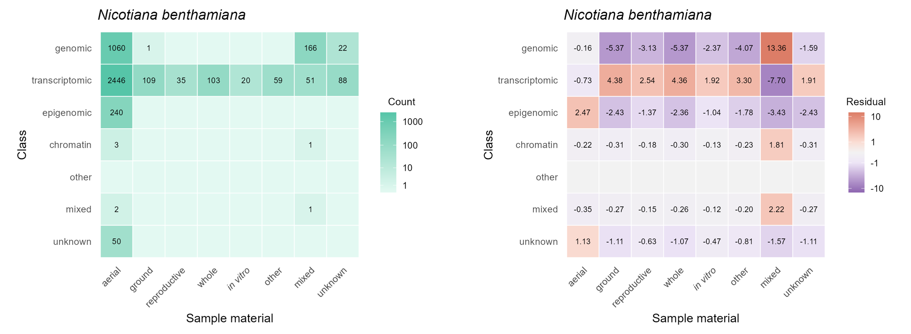

# User Guide

> Note: GAMA was developed iteratively in response to observed archive behaviour, failure modes, and metadata-recovery bottlenecks. This user guide describes the major methodological principles, including data retrieval, classification, and summary metrics. However, users should refer to the package source code for their exact implementation, as well as fallback rules, validation checks, and edge-case handling applied during analysis.

---

## Contents

<div>
<a href="#overview">Overview</a><br>
<a href="#quick-start">Quick-start</a><br>
&nbsp;&nbsp;<a href="#installation">Installation</a><br>
&nbsp;&nbsp;<a href="#1-load-package">1. Load package</a><br>
&nbsp;&nbsp;<a href="#2-configure-ncbi-access-to-improve-rate-limits-optional">2. Configure NCBI access to improve rate limits (optional)</a><br>
&nbsp;&nbsp;<a href="#3-query-ncbi-databases-using-a-list-of-species">3. Query NCBI databases using a list of species</a><br>
&nbsp;&nbsp;<a href="#4-summarise-data-richness">4. Summarise data richness</a><br>
&nbsp;&nbsp;<a href="#5-visualise-data-richness">5. Visualise data richness</a><br>
&nbsp;&nbsp;<a href="#6-summarise-sra-modality-composition">6. Summarise SRA modality composition</a><br>
&nbsp;&nbsp;<a href="#7-visualise-sra-modality-composition">7. Visualise SRA modality composition</a><br>
&nbsp;&nbsp;<a href="#8-extract-filtered-assembly-accession-metadata">8. Extract filtered Assembly accession metadata</a><br>
&nbsp;&nbsp;<a href="#9-extract-filtered-sra-accession-metadata">9. Extract filtered SRA accession metadata</a><br>
&nbsp;&nbsp;<a href="#10-cite">10. Cite</a><br>
<a href="#dependencies">Dependencies</a><br>
<a href="#functions">Functions</a><br>
&nbsp;&nbsp;<a href="#query_species">query_species()</a><br>
&nbsp;&nbsp;<a href="#summarise_availability">summarise_availability()</a><br>
&nbsp;&nbsp;<a href="#plot_availability">plot_availability()</a><br>
&nbsp;&nbsp;<a href="#summarise_assembly_availability">summarise_assembly_availability()</a><br>
&nbsp;&nbsp;<a href="#plot_assembly_availability">plot_assembly_availability()</a><br>
&nbsp;&nbsp;<a href="#extract_assembly_metadata">extract_assembly_metadata()</a><br>
&nbsp;&nbsp;<a href="#summarise_sra_availability">summarise_sra_availability()</a><br>
&nbsp;&nbsp;<a href="#plot_sra_availability">plot_sra_availability()</a><br>
&nbsp;&nbsp;<a href="#plot_sra_geo">plot_sra_geo()</a><br>
&nbsp;&nbsp;<a href="#summarise_sra_skew">summarise_sra_skew()</a><br>
&nbsp;&nbsp;<a href="#plot_sra_skew">plot_sra_skew()</a><br>
&nbsp;&nbsp;<a href="#extract_sra_metadata">extract_sra_metadata()</a><br>
&nbsp;&nbsp;<a href="#summarise_biosample_availability">summarise_biosample_availability()</a><br>
&nbsp;&nbsp;<a href="#plot_biosample_availability">plot_biosample_availability()</a><br>
&nbsp;&nbsp;<a href="#summarise_biosample_skew">summarise_biosample_skew()</a><br>
&nbsp;&nbsp;<a href="#plot_biosample_skew">plot_biosample_skew()</a><br>
&nbsp;&nbsp;<a href="#extract_biosample_metadata">extract_biosample_metadata()</a><br>
&nbsp;&nbsp;<a href="#summarise_interaction">summarise_interaction()</a><br>
&nbsp;&nbsp;<a href="#plot_interaction">plot_interaction()</a><br>
<a href="#methods">Methods</a><br>
&nbsp;&nbsp;<a href="#retrieval">Retrieval</a><br>
&nbsp;&nbsp;<a href="#data-richness">Data richness</a><br>
&nbsp;&nbsp;<a href="#ontology-driven-classification">Ontology-driven classification</a><br>
&nbsp;&nbsp;<a href="#replication-skew">Replication skew</a><br>
&nbsp;&nbsp;<a href="#residuals">Residuals</a><br>
<a href="#limitations">Limitations</a><br>
<a href="#development">Development</a><br>
<a href="#references">References</a>
</div>

---

## Overview

GAMA (Genomic Availability & Metadata Analysis Tool) is an R-based framework for efficiently surveying publicly accessible sequencing data for user-defined sets of species. It unifies NCBI Assembly, SRA, and BioSample query searches to generate availability summaries and ontology-based breakdowns of accession metadata. GAMA is intended to support feasibility assessments for *in silico* research on underutilised plants. By revealing what records exist, how they are structured, and where gaps remain, this package promotes secondary data use and the effective prioritisation of future sequencing efforts.

---

## Quick-start

### Installation

GAMA is currently distributed via GitHub and can be installed using pak (Csárdi & Hester, 2025).

```r
install.packages('pak')
pak::pak('JLewis-dev/GAMA')
```

### 1. Load package

```r
library(GAMA)
```

### 2. Configure NCBI access to improve rate limits (optional)

```r
#rentrez::set_entrez_key('YOUR_API_KEY')
```

Uncomment and add your API key if you have one.

### 3. Query NCBI databases using a list of species

```r
RESULTS <- query_species(c('Vigna angularis', 'Vigna vexillata'))
```

### 4. Summarise data richness

```r
SUMMARY <- summarise_availability(RESULTS)
print(SUMMARY)
```

### 5. Visualise data richness

```r
plot_availability(SUMMARY)
```

### 6. Summarise SRA modality composition

```r
SRA_SUMMARY <- summarise_sra_availability(RESULTS)
print(SRA_SUMMARY)
```

### 7. Visualise SRA modality composition

```r
plot_sra_availability(SRA_SUMMARY)
```

### 8. Extract filtered Assembly accession metadata

```r
ASM <- extract_assembly_metadata(RESULTS, species = 'Vigna angularis', best = TRUE)
print(ASM)
```

### 9. Extract filtered SRA accession metadata

```r
SRA <- extract_sra_metadata(RESULTS, species = 'Vigna vexillata', class = 'genomic')
print(SRA)
```

### 10. Cite

```r
citation('GAMA')
```

---

## Dependencies

GAMA is implemented in R (≥4.2.0) and built on tidyverse tooling for data manipulation, iteration, and plotting (R Core Team, 2024; Wickham *et al.*, 2023; Wickham *et al.*, 2025; Wickham & Henry, 2026). NCBI Entrez eUtils queries are performed via rentrez (Winter, 2017; National Center for Biotechnology Information, 2026), and the SRA expxml field is parsed with xml2 (Wickham *et al.*, 2026). Tabular outputs use tibble (Müller & Wickham, 2026), while plots are produced with ggplot2 (Wickham, 2016). Ensure that all dependencies are installed prior to running GAMA.

---

## Functions

The function list below is organised by workflow and NCBI database: core querying and availability summaries first, followed by Assembly, SRA, and BioSample analyses, and finally their interaction. For a visual guide, see the [API map](../man/figures/API_map.png).

### query_species()

Searches NCBI Assembly, SRA, and BioSample for one or more species, creating the central GAMA query object used by all summary, plot, and metadata extraction functions.

- Input – character vector of binomial species names
  - Optional arguments –<br>
    &nbsp;&nbsp;`synonyms`: named list or named character vector; map canonical species names to one or more synonymous names for query collapse (NULL, one or more synonym mappings)
- Output – named list with one element per canonical species containing Assembly, SRA, and BioSample query results, including record IDs and counts; when the synonyms argument is supplied, results are merged across aliases using unique database record identifiers

### summarise_availability()

Provides a compact species-level overview of public archive availability by combining Assembly, SRA, and BioSample record counts into a composite data richness score (see [Data richness](#data-richness)).

- Input – list returned by `query_species()`
  - Optional arguments –<br>
    &nbsp;&nbsp;none
- Output – tibble (`gdt_tbl`) with one row per species containing Assembly, SRA, and BioSample record counts, component scores (A, S, B), and a composite data richness score (score)

### plot_availability()

Visualises species-level data richness using stacked bar segments for Assembly, SRA, and BioSample score contributions.

- Input – tibble returned by `summarise_availability()`
  - Optional arguments –<br>
    &nbsp;&nbsp;`rank`: character; species ordering method ('highest', 'lowest', 'A-Z', 'Z-A', 'input')<br>
    &nbsp;&nbsp;`abbreviate`: logical; abbreviate species names (TRUE, FALSE)<br>
    &nbsp;&nbsp;`theme_fn`: function; ggplot2 theme function (`ggplot2::theme_minimal`)<br>
    &nbsp;&nbsp;`colours`: named character vector; fill colours for Assembly, SRA, and BioSample segments
- Output – ggplot showing stacked data richness score components across species

### summarise_assembly_availability()

Provides a species-level overview of Assembly composition by classifying records by assembly level and reporting the best N50.

- Input – list returned by `query_species()`
  - Optional arguments –<br>
    &nbsp;&nbsp;`species`: character vector; species from list to include (NULL, one or more species names)
- Output – tibble (`gdt_tbl`) with one row per species containing total Assembly record count, recognised assembly level counts ('complete', 'chromosome', 'scaffold', 'contig'), and `best_n50`

### plot_assembly_availability()

Visualises species-level Assembly composition using stacked horizontal bars.

- Input – tibble returned by `summarise_assembly_availability()`
  - Optional arguments –<br>
    &nbsp;&nbsp;`species`: character vector; species from tibble to include (NULL, one or more species names)<br>
    &nbsp;&nbsp;`rank`: character; species ordering method ('highest', 'lowest', 'A-Z', 'Z-A', 'input')<br>
    &nbsp;&nbsp;`abbreviate`: logical; abbreviate species names (TRUE, FALSE)<br>
    &nbsp;&nbsp;`theme_fn`: function; ggplot2 theme function (`ggplot2::theme_minimal`)<br>
    &nbsp;&nbsp;`colours`: named character vector; fill colours for Assembly levels
- Output – ggplot showing proportional Assembly level composition across species, with total Assembly record counts labelled

### extract_assembly_metadata()

Returns record-level Assembly metadata for deeper inspection, including assembly level, N50, coverage, BioSample/BioProject links, submitter, release date, and FTP path.

- Input – list returned by `query_species()`
  - Optional arguments –<br>
    &nbsp;&nbsp;`species`: character vector; species from list to include (NULL, one or more species names)<br>
    &nbsp;&nbsp;`best`: logical; return the best assembly per species (FALSE, TRUE)
- Output – tibble (`gdt_tbl`) containing Assembly metadata, including species, `entrez_uid`, level, n50, coverage, biosample, bioproject, submitter, release_date, and ftp_path

### summarise_sra_availability()

Provides a species-level overview of SRA modality composition by classifying SRA metadata into ontology-assigned modality classes and subclasses (see [Ontology-driven classification](#ontology-driven-classification)).

- Input – list returned by `query_species()`
  - Optional arguments –<br>
    &nbsp;&nbsp;`species`: character vector; species from list to include (NULL, one or more species names)<br>
    &nbsp;&nbsp;`all`: logical; include subclass-level columns (FALSE, TRUE)<br>
    &nbsp;&nbsp;`include_geo`: logical; append GEO summary columns (FALSE, TRUE)
- Output – tibble (`gdt_tbl`) with one row per species containing total SRA records and class-level modality counts; caches UID-level profiles attached to the output tibble as `attr(x, 'sra_profile')` and profile metadata as `attr(x, 'sra_profile_info')` for downstream GEO linkage plotting, replication-skew analysis, and SRA × BioSample interaction summaries

### plot_sra_availability()

Visualises species-level SRA modality composition using stacked horizontal bars.

- Input – tibble returned by `summarise_sra_availability()`
  - Optional arguments –<br>
    &nbsp;&nbsp;`species`: character vector; species from tibble to include (NULL, one or more species names)<br>
    &nbsp;&nbsp;`rank`: character; species ordering method ('highest', 'lowest', 'A-Z', 'Z-A', 'input')<br>
    &nbsp;&nbsp;`abbreviate`: logical; abbreviate species names (TRUE, FALSE)<br>
    &nbsp;&nbsp;`theme_fn`: function; ggplot2 theme function (`ggplot2::theme_minimal`)<br>
    &nbsp;&nbsp;`colours`: named character vector; fill colours for SRA modality classes
- Output – ggplot showing proportional SRA modality composition across species, with total SRA record counts labelled

### plot_sra_geo()

Visualises GEO linkage across SRA modality classes, excluding genomic records.

- Input – tibble returned by `summarise_sra_availability()`
  - Optional arguments –<br>
    &nbsp;&nbsp;`species`: character vector; species from tibble to plot (NULL, one or more species names)<br>
    &nbsp;&nbsp;`rank`: character; species ordering method ('highest', 'lowest', 'A-Z', 'Z-A', 'input')<br>
    &nbsp;&nbsp;`theme_fn`: function; ggplot2 theme function (`ggplot2::theme_minimal`)<br>
    &nbsp;&nbsp;`colours`: named character vector; fill colours for SRA modality classes<br>
    &nbsp;&nbsp;`alpha_vals`: named numeric vector; transparency values for GEO linkage
- Output – ggplot for a single species, or a named list of ggplot objects for multiple species, showing per-modality GEO linkage using cached profiles attached to the input tibble as `attr(x, 'sra_profile')`

### summarise_sra_skew()

Quantifies whether SRA records are broadly distributed across BioProjects or BioSamples, or concentrated within a small number of dominant units (see [Replication skew](#replication-skew)).

- Input – tibble returned by `summarise_sra_availability()` with cached UID-level profiles attached as `attr(x, 'sra_profile')`
  - Optional arguments –<br>
    &nbsp;&nbsp;`species`: character vector; species from tibble to include (NULL, one or more species names)<br>
    &nbsp;&nbsp;`unit`: character; skew unit ('bioproject', 'biosample')<br>
    &nbsp;&nbsp;`class`: character scalar; single modality class to analyse (NULL, one class name)
- Output – tibble (`gdt_tbl`) with one row per species containing unit count, class, boxplot summary statistics of SRA records per unit (min, q25, med, q75, max), and inverse Simpson index (eff)

### plot_sra_skew()

Visualises SRA replication skew using the summary output of `summarise_sra_skew()`.

- Input – tibble returned by `summarise_sra_skew()`
  - Optional arguments –<br>
    &nbsp;&nbsp;`species`: character vector; species from tibble to plot (NULL, one or more species names)<br>
    &nbsp;&nbsp;`rank`: character; species ordering method ('highest', 'lowest', 'A-Z', 'Z-A', 'input')<br>
    &nbsp;&nbsp;`abbreviate`: logical; abbreviate species labels (TRUE, FALSE)<br>
    &nbsp;&nbsp;`theme_fn`: function; ggplot2 theme function (`ggplot2::theme_minimal`)<br>
    &nbsp;&nbsp;`colours`: named character vector; box fill and line colours<br>
    &nbsp;&nbsp;`show_points`: logical; overlay per-unit points when cached profiles are available (TRUE, FALSE)<br>
    &nbsp;&nbsp;`point_colour`: character scalar; point colour<br>
    &nbsp;&nbsp;`point_alpha`: numeric; point transparency<br>
    &nbsp;&nbsp;`show_labels`: logical; label each box with eff and n (TRUE, FALSE)<br>
    &nbsp;&nbsp;`label_digits`: integer; decimal places for eff labels
- Output – ggplot visualising replication skew across species on a log10 scale, with optional per-unit point overlays when cached profiles are available

### extract_sra_metadata()

Returns SRA record metadata for deeper inspection, including ontology-assigned modality, BioSample/BioProject identifiers, and GEO linkage fields.

- Input – list returned by `query_species()`
  - Optional arguments –<br>
    &nbsp;&nbsp;`species`: character vector; species from list to include (NULL, one or more species names)<br>
    &nbsp;&nbsp;`class`: character vector; modality classes to filter by (NULL, one or more class names)<br>
    &nbsp;&nbsp;`subclass`: character vector; modality subclasses to filter by (NULL, one or more subclass names)<br>
    &nbsp;&nbsp;`only_geo`: logical; retain only GEO-linked records (FALSE, TRUE)
- Output – tibble (`gdt_tbl`) containing SRA metadata, including species, entrez_uid, biosample, bioproject, strategy_raw, strategy_norm, class, subclass, geo_linked, gse_ids, and gsm_ids

### summarise_biosample_availability()

Provides a species-level overview of BioSample anatomy composition by collapsing sample-source metadata into ontology-assigned anatomy class, subclass, and term counts (see [Ontology-driven classification](#ontology-driven-classification)).

- Input – list returned by `query_species()`
  - Optional arguments –<br>
    &nbsp;&nbsp;`species`: character vector; species from list to include (NULL, one or more species names)<br>
    &nbsp;&nbsp;`all`: logical; include canonical anatomy-term columns (FALSE, TRUE)
- Output – tibble (`gdt_tbl`) with one row per species containing total BioSample record counts, operable BioSample record counts, and class-level anatomy counts; when all = TRUE, canonical anatomy-term counts are included; cached BioSample-level profiles are attached as `attr(x, 'biosample_anatomy_profile')` and `attr(x, 'biosample_canonical_profile')` for downstream skew analysis and SRA × BioSample interaction summaries

### plot_biosample_availability()

Visualises species-level BioSample anatomy composition using stacked horizontal bars.

- Input – tibble returned by `summarise_biosample_availability()`
  - Optional arguments –<br>
    &nbsp;&nbsp;`species`: character vector; species from tibble to include (NULL, one or more species names)<br>
    &nbsp;&nbsp;`rank`: character; species ordering method ('highest', 'lowest', 'A-Z', 'Z-A', 'input')<br>
    &nbsp;&nbsp;`abbreviate`: logical; abbreviate species names (TRUE, FALSE)<br>
    &nbsp;&nbsp;`theme_fn`: function; ggplot2 theme function (`ggplot2::theme_minimal`)<br>
    &nbsp;&nbsp;`colours`: named character vector; fill colours for BioSample anatomy classes
- Output – ggplot showing proportional BioSample anatomy composition across species, calculated over operable BioSample records, with operable BioSample record counts labelled

### summarise_biosample_skew()

Quantifies whether BioSample records are broadly distributed across BioProjects or concentrated within a small number of dominant units (see [Replication skew](#replication-skew)).

- Input – tibble returned by `summarise_biosample_availability()` with cached BioSample-level profiles attached as `attr(x, 'biosample_anatomy_profile')`
  - Optional arguments –<br>
    &nbsp;&nbsp;`species`: character vector; species from tibble to include (NULL, one or more species names)<br>
    &nbsp;&nbsp;`anatomy_class`: character scalar; single anatomy class to analyse (NULL, one anatomy class)
- Output – tibble (`gdt_tbl`) with one row per species containing BioProject count, anatomy_class, boxplot summary statistics of operable BioSample records per BioProject (min, q25, med, q75, max), and inverse Simpson index (eff)

### plot_biosample_skew()

Visualises BioSample replication skew using the summary output of `summarise_biosample_skew()`.

- Input – tibble returned by `summarise_biosample_skew()`
  - Optional arguments –<br>
    &nbsp;&nbsp;`species`: character vector; species from tibble to plot (NULL, one or more species names)<br>
    &nbsp;&nbsp;`rank`: character; species ordering method ('highest', 'lowest', 'A-Z', 'Z-A', 'input')<br>
    &nbsp;&nbsp;`abbreviate`: logical; abbreviate species labels (TRUE, FALSE)<br>
    &nbsp;&nbsp;`theme_fn`: function; ggplot2 theme function (`ggplot2::theme_minimal`)<br>
    &nbsp;&nbsp;`colours`: named character vector; box fill and line colours<br>
    &nbsp;&nbsp;`show_points`: logical; overlay per-BioProject points when cached profiles are available (TRUE, FALSE)<br>
    &nbsp;&nbsp;`point_colour`: character scalar; point colour<br>
    &nbsp;&nbsp;`point_alpha`: numeric; point transparency<br>
    &nbsp;&nbsp;`show_labels`: logical; label each box with eff and n (TRUE, FALSE)<br>
    &nbsp;&nbsp;`label_digits`: integer; decimal places for eff labels
- Output – ggplot visualising replication skew across species on a log10 scale, with optional per-BioProject point overlays when cached profiles are available

### extract_biosample_metadata()

Returns record-level BioSample source-material metadata for deeper inspection, including recovered sample-source values, ontology assignments, and collapsed anatomy profiles.

- Input – list returned by `query_species()`
  - Optional arguments –<br>
    &nbsp;&nbsp;`species`: character vector; species from list to include (NULL, one or more species names)<br>
    &nbsp;&nbsp;`anatomy_class`: character vector; anatomy classes to filter by (NULL, one or more anatomy classes)<br>
    &nbsp;&nbsp;`anatomy_subclass`: character vector; anatomy subclasses to filter by (NULL, one or more anatomy subclasses)<br>
    &nbsp;&nbsp;`anatomy_term`: character vector; canonical anatomy terms to filter by (NULL, one or more anatomy terms)
- Output – tibble (`gdt_tbl`) with one row per BioSample anatomy term, including identifiers, raw and normalised sample-source values, ontology assignments, and anatomy_class_profile and anatomy_subclass_profile labels

### summarise_interaction()

Summarises cross-database SRA × BioSample structure by linking cached SRA modality profiles with cached BioSample anatomy profiles (see [Residuals](#residuals)).

- Input – tibble returned by `summarise_sra_availability()` and tibble returned by `summarise_biosample_availability()`
  - Optional arguments –<br>
    &nbsp;&nbsp;`level`: character; anatomy resolution to summarise ('anatomy_class', 'anatomy_subclass')<br>
    &nbsp;&nbsp;`species`: character vector; species from the input summaries to include (NULL, one or more species names)
- Output – tibble (`gdt_tbl`) with one row per species, modality class, and anatomy category; columns include species, class, BioSample, expected, and residual, plus either anatomy_class or anatomy_subclass depending on level; interaction metadata are attached as `attr(x, 'interaction_info')`

### plot_interaction()

Visualises SRA × BioSample interaction summaries as modality-by-anatomy heatmaps.

- Input – tibble returned by `summarise_interaction()`
  - Optional arguments –<br>
    &nbsp;&nbsp;`species`: character vector; species from the interaction summary to plot (NULL, one or more species names)<br>
    &nbsp;&nbsp;`value`: character; heatmap value to display ('count', 'residual')<br>
    &nbsp;&nbsp;`rank`: character; species ordering method ('highest', 'lowest', 'A-Z', 'Z-A', 'input')<br>
    &nbsp;&nbsp;`theme_fn`: function; ggplot2 theme function (`ggplot2::theme_minimal`)<br>
    &nbsp;&nbsp;`low_fill`: character scalar; low count fill colour<br>
    &nbsp;&nbsp;`high_fill`: character scalar; high count fill colour<br>
    &nbsp;&nbsp;`positive_low_fill`: character scalar; low positive residual fill colour<br>
    &nbsp;&nbsp;`positive_high_fill`: character scalar; high positive residual fill colour<br>
    &nbsp;&nbsp;`negative_low_fill`: character scalar; low negative residual fill colour<br>
    &nbsp;&nbsp;`negative_high_fill`: character scalar; high negative residual fill colour<br>
    &nbsp;&nbsp;`zero_fill`: character scalar; zero residual fill colour<br>
    &nbsp;&nbsp;`na_fill`: character scalar; missing value fill colour<br>
    &nbsp;&nbsp;`show_values`: logical; show cell values (TRUE, FALSE)<br>
    &nbsp;&nbsp;`value_size`: numeric; cell-value text size
- Output – ggplot for a single species, or a named list of ggplot objects for multiple species; with value = 'count', the heatmap shows linked BioSample record counts; with value = 'residual', the heatmap shows Pearson residuals from the species-level marginal expectation

---

## Methods

### Retrieval

GAMA is organised around two archive-interrogation layers:

**Genomic Availability** – Introduces `query_species()` as the entry point for GAMA, creating a species-indexed search object that anchors downstream summaries, visualisations, and metadata extraction. It queries NCBI Assembly, SRA, and BioSample through rentrez, using organism-constrained searches, `retmax = 999999`, and Entrez history tracking. Returned identifiers, record counts, and `web_history` context are preserved for later retrieval. Search requests use retrying handlers with increasing back-off, while Assembly, SRA, and BioSample records are recovered through shared `entrez_summary()` helpers in batches of up to 100 records, using returned identifiers where available and Entrez history context where history-aware retrieval is required. Records are structured with dplyr, tidyr, and purrr, with provenance metadata attached to all query-derived outputs.

**Metadata Analysis** – Performs deeper, database-specific metadata parsing and normalisation. For Assembly, stored identifiers are used to retrieve NCBI summary records, from which assembly level, N50, coverage, BioSample/BioProject links, submitter details, release date, and FTP path are extracted and flattened into tidy metadata fields. For SRA, the expxml field is parsed using xml2 to extract and normalise LIBRARY_STRATEGY, which is then assigned to a modality class and subclass using the internal ontology and strict matching. Missing, uninformative, or explicitly other strategies are rescued using LIBRARY_SOURCE, LIBRARY_SELECTION, and TITLE. Records that remain missing or uninformative after fallback parsing are retained as unknown; non-missing, interpretable strategies that fall outside the ontology are retained as other. GEO linkage is recorded by scanning experiment XML for GSE/GSM accessions and cached alongside BioSample/BioProject identifiers. For BioSample, record-level metadata are screened for accepted sample-source attributes, including tissue, organism part, cell type, tissue type, and organ. A BioSample record is treated as operable when an accepted sample-source attribute is present. Accepted attribute values are then parsed against the curated anatomy ontology. Missing-like values, or values with no ontological match, are retained as unknown; broad, generic, or subcellular anatomy values are classified as other; records with multiple recovered anatomy classes are classified as mixed. BioSample-level anatomy profiles are cached by BioSample identifier so subsequent skew and archive interaction workflows can reuse the recovered metadata.

### Data richness

*Score* = *A* + *S* + *B*, where *A*, *S*, and *B* are the transformed contributions of Assembly, SRA, and BioSample record counts. *A* = *best* + ln(1 + *total* − *best*), with assemblies weighted as Complete = 10, Chromosome = 8, Scaffold = 5, and Contig = 2; *best* is the maximum-weight assembly, with ties broken by highest N50, and *total* is the sum of all record weights. *S* = 2·ln(1 + SRA), and *B* = ln(1 + BioSample). This formulation prioritises high-quality assemblies while incorporating diminishing returns for extensively sampled taxa.

### Ontology-driven classification

GAMA uses curated ontologies derived from archive text mining to classify NCBI metadata through normalised exact matching. Its present core retrieval engines descend from the same parsing workflows used to collate the initial vocabularies. This creates an empirically grounded classification framework in which ontology construction and metadata retrieval are methodologically aligned. Rather than imposing a vocabulary compiled independently of the target records, GAMA first mines real submitter language to identify recurrent terms, variants, and community-specific terminology, then applies refined versions of that same parsing logic to classify new metadata against the curated ontology.

For SRA, modality terms and recognised variants were derived by mining >220,000 *Arabidopsis thaliana* accessions (conducted 31 January 2026) before manual curation to capture common submitter variants and deprecated terminology. Assignment is based primarily on normalised LIBRARY_STRATEGY terms, with conservative fallback to related SRA metadata fields, including LIBRARY_SOURCE, LIBRARY_SELECTION, and record title, when the primary strategy field is missing, unknown, or uninformative.

For BioSample, anatomy terms and recognised variants were derived by mining >750,000 BioSample records across ten representative angiosperm species selected as data-rich examples of major lineages: *A. thaliana*, *Brachypodium distachyon*, *Glycine max*, *Malus domestica*, *Manihot esculenta*, *Oryza sativa*, *Populus trichocarpa*, *Solanum lycopersicum*, *Solanum tuberosum*, and *Zea mays* (conducted 24 February 2026). This produced a corpus with broad anatomical coverage and substantial terminological depth. However, the ontology has since been expanded using gymnosperm, pteridophyte, and bryophyte data. Because compiled BioSample free-text metadata proved too heterogeneous for stable classification, curation was restricted to a reliable subset of sample-source attributes, including tissue, organism part, cell type, tissue type, and organ.

### Replication skew

*eff* = 1 / Σ(*pᵢ*²), where *pᵢ* = *nᵢ* / *N*, *nᵢ* is the number of records in unit *i* (BioProject or BioSample), *N* = Σ(*nᵢ*) is the total number of records, and *n* is the number of distinct units. This is the inverse Simpson index, expressed as an ‘effective number’ of units: *eff* = 1 when all records come from a single dominant BioProject/BioSample (Simpson, 1949), and *eff* increases towards *n* as records are distributed more evenly across many units (Hill, 1973). Archive record counts grouped by BioProject or BioSample are often long-tailed. The squared-proportion weighting makes *eff* appropriately sensitive to dominance (replication skew) without being inflated by numerous singletons, providing a compact, comparable measure of replication structure alongside raw record counts (Jost, 2006).

### Residuals

Residuals quantify whether an SRA modality–BioSample anatomy combination is over- or under-represented relative to a marginal expectation. For each species, expected counts are calculated under a simple independence model in which sequencing modality and anatomy category are assumed to occur in proportion to their overall frequencies: *Eᵢⱼ* = (*Rᵢ* × *Cⱼ*) / *N*, where *Rᵢ* is the total number of records in SRA modality *i*, *Cⱼ* is the total number of records in BioSample anatomy category *j*, and *N* is the total number of linked records. Pearson residuals are then calculated as *rᵢⱼ* = (*Oᵢⱼ* − *Eᵢⱼ*) / √(*Eᵢⱼ*), where *Oᵢⱼ* is the observed count for each modality–anatomy combination (Pearson, 1900). Positive residuals indicate combinations observed more often than expected, while negative residuals indicate combinations observed less often than expected. This helps reveal species-level biases and gaps that raw counts alone may obscure, since common combinations such as genomic leaf records can appear dominant simply because both the sequencing modality and tissue type are broadly popular (Fig. 1).

<p align='center'>
  
</p>

**Figure 1.** Interaction heatmaps showing BioSample counts and Pearson residuals for linked SRA modality and BioSample anatomy profiles generated using GAMA 0.3.2 with a *Nicotiana benthamiana* query (conducted 2 June 2026; 16:19:35 UTC). Residuals are calculated relative to the species-level marginal expectation, highlighting modality–anatomy combinations observed more or less often than expected.

---

## Limitations

- Dependent on NCBI metadata quality
- Runtime increases with species list size
- Novel protocols may not be fully captured by the modality ontology
- The anatomy ontology is broad but not exhaustive and will require refinement
- Results should be interpreted cautiously during early development

---

## Development

GAMA aims to comprehensively summarise the metadata landscape underlying public sequencing resources. Development is focussed on BioSample experimental parameters, extracting structured summaries of core descriptors (e.g. tissue, development stage, genotype, treatment, and provenance). A key challenge is balancing capture with specificity. Broader parsing can recover more candidate information but also increases the risk of over-interpreting context-dependent free text. Inconsistent field use, missing values, and study-specific terminology make it difficult to distinguish true experimental parameters from incidental references. Future development will focus on progressively extending BioSample metadata recovery while retaining conservative classification rules and explicit uncertainty categories.

---

## References

**Csárdi G. and Hester J. (2025)** pak: Another Approach to Package Installation. R package version 0.9.2.

**Hill M.O. (1973)** Diversity and evenness: a unifying notation and its consequences. *Ecology*, **54**: 427-432.

**Jost L. (2006)** Entropy and diversity. *Oikos*, **113**: 363-375.

**Müller K. and Wickham H. (2026)** tibble: Simple Data Frames. R package version 3.3.1.

**National Center for Biotechnology Information (2026)** Entrez Programming Utilities. National Library of Medicine. Available at: https://www.ncbi.nlm.nih.gov (Accessed: 31 January 2026).

**Pearson K. (1900)** On the criterion that a given system of deviations from the probable in the case of a correlated system of variables is such that it can be reasonably supposed to have arisen from random sampling. *The London, Edinburgh, and Dublin Philosophical Magazine and Journal of Science*, **50**: 157-175.

**R Core Team (2024)** R: A Language and Environment for Statistical Computing. R Foundation for Statistical Computing, Vienna, Austria.

**Simpson E.H. (1949)** Measurement of diversity. *Nature*, **163**: 688.

**Wickham H. (2016)** ggplot2: Elegant Graphics for Data Analysis. Springer-Verlag, New York.

**Wickham H., François R., Henry L., Müller K. and Vaughan D. (2023)** dplyr: A Grammar of Data Manipulation. R package version 1.1.4.

**Wickham H., Vaughan D. and Girlich M. (2025)** tidyr: Tidy Messy Data. R package version 1.3.2.

**Wickham H. and Henry L. (2026)** purrr: Functional Programming Tools. R package version 1.2.1.

**Wickham H., Hester J. and Ooms J. (2026)** xml2: Parse XML. R package version 1.5.2.

**Winter D.J. (2017)** rentrez: An R package for the NCBI eUtils API. *The R Journal*, **9**: 520-526.

---
